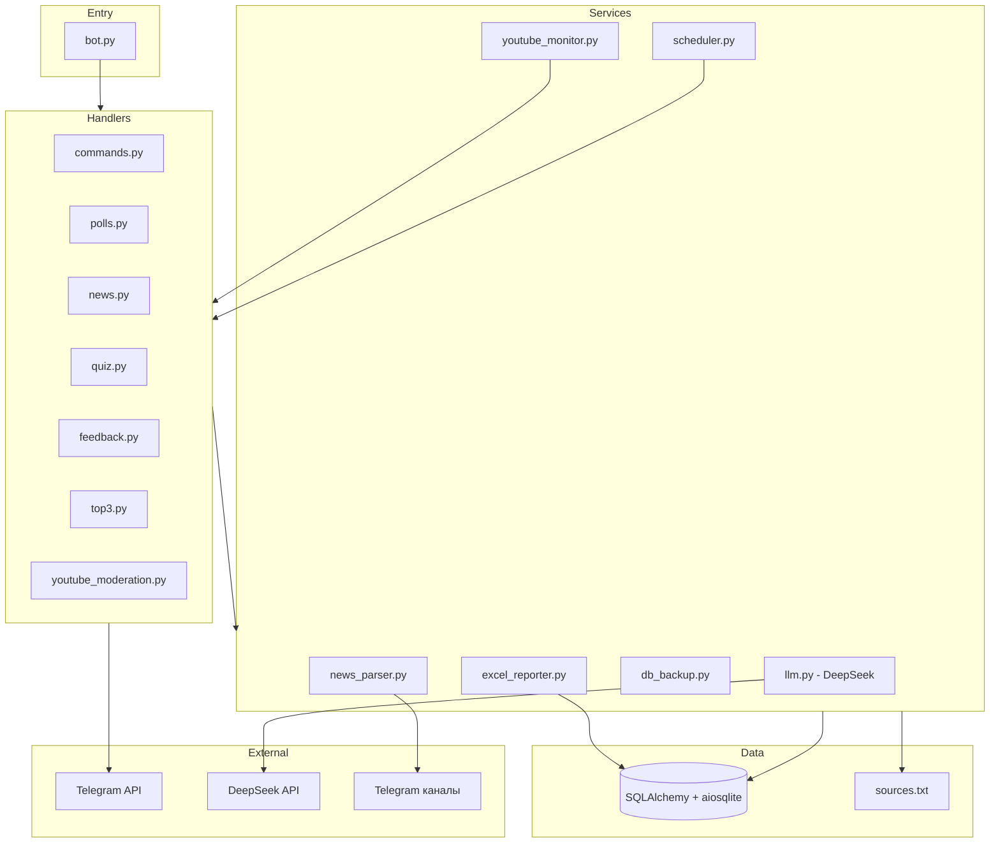
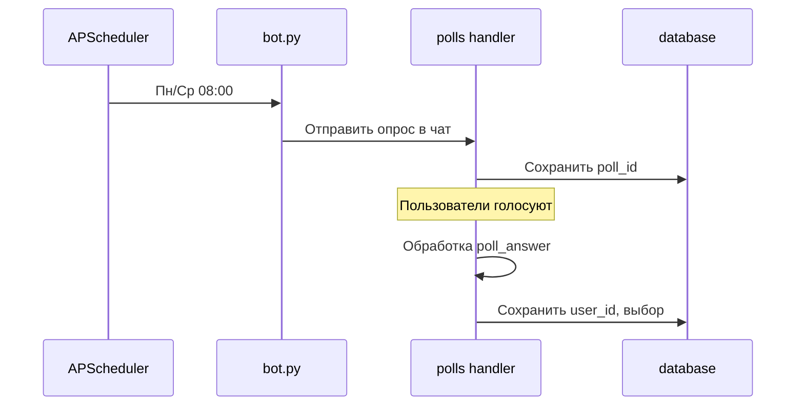
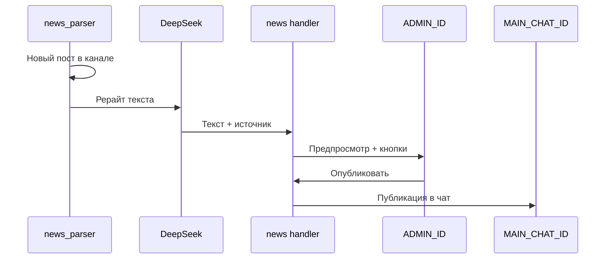

# RZDBadminton Bot — Описание проекта

> Автономный Telegram-бот для управления спортивной секцией «Бадминтон РЖД»

**Версия документа:** 1.1  
**Дата:** 2026-03-01

---

## 1. Цели и назначение

### 1.1 Бизнес-цели

- Автоматизация учёта посещаемости тренировок
- Агрегация и модерация новостей из внешних каналов
- Повышение вовлечённости участников (квизы, обратная связь, рейтинг)
- Формирование отчётности для руководства секции

### 1.2 Целевая аудитория

- Участники секции «Бадминтон РЖД»
- Администратор секции (модерация новостей, алерты)
- Руководство (отчёты по посещаемости)

---

## 2. Контекст и расписание

| Параметр | Значение |
|----------|----------|
| **Тренировки** | Понедельник и Среда, 20:15 – 22:45 |
| **Место** | Олимпийский центр имени братьев Знаменских, ул. Стромынка, д.4, стр.1 |
| **Основной чат** | Бадминтон ЦФСК_чат (ID в `.env`) |
| **Тестовая группа** | [Тестовая группа RZDBadminton](https://t.me/+85gt0Sp-2RhiZWJi) |

---

## 3. Функциональные требования

### 3.1 Опросы и посещаемость

| ID | Требование | Приоритет |
|----|------------|-----------|
| F-001 | Каждый Пн и Ср в 08:00 — публичный опрос «Будете сегодня на тренировке?» | Критический |
| F-002 | Варианты ответа: «Приду 🙋‍♂️», «Не приду 😔», «Может быть 🤔» | Критический |
| F-003 | Сохранение в БД: user_id, имя, выбор (0=Приду, 1=Не приду, 2=Может быть) | Критический |
| F-003a | **Неанонимный опрос** — ответы видны всем участникам чата | Критический |
| F-003b | **Возможность изменить ответ** — пользователь может переголосовать; при смене — обновлять запись в БД | Критический |
| F-003c | Стиль опросов — по примерам из `Doc/Опросы/` | Высокий |

### 3.2 Отчётность

| ID | Требование | Приоритет |
|----|------------|-----------|
| F-004 | Каждый Пн и Ср в 23:00 — формирование месячного Excel-отчёта по данным БД | Критический |
| F-005 | Отчёт: pivot за месяц (участники × даты тренировок), генерация из плоских данных (excel_reporter) | Критический |
| F-006 | **Отправка файла отчёта в личные сообщения администратору** (не в групповой чат) | Критический |
| F-007 | Ручная выдача отчёта: команда /report и кнопка «📊 Отчёт» в админ-панели — тоже в личку админу | Критический |
| F-008 | При сбое формирования отчёта — сообщение об ошибке в личку админу | Высокий |

### 3.3 Агрегатор новостей с модерацией

| ID | Требование | Приоритет |
|----|------------|-----------|
| F-009 | Источники — из `sources.txt` (одна ссылка на строку) | Критический |
| F-010 | Парсинг новых постов через Telethon | Критический |
| F-011 | Рерайт через DeepSeek (инструкция в коде) | Критический |
| F-012 | Модерация: отправка в личку ADMIN_ID с кнопками [Опубликовать], [Отклонить], [Редактировать] | Критический |
| F-013 | Публикация только после «Опубликовать» | Критический |
| F-014 | Сессия Telethon в файле; при вылете — алерт админу | Высокий |

### 3.4 Вовлечение и геймификация

| ID | Требование | Приоритет |
|----|------------|-----------|
| F-015 | Пятница 12:00 — квиз по правилам бадминтона (НФБР, DeepSeek); объяснение и ссылка на правила | Высокий |
| F-016 | Пн и Ср 22:45 — опрос оценки 1–5 в общий чат; Пт 11:45 — итоги за неделю; 1-го в 10:00 — итоги за месяц | Высокий |
| F-017 | 1-го числа в 09:00 — пост с Топ-3 по посещаемости в чат | Высокий |
| F-018 | Мониторинг YouTube «BWF TV»: новые видео на модерацию в личку админу; публикация в чат только после одобрения | Средний |

### 3.5 База знаний

| ID | Требование | Приоритет |
|----|------------|-----------|
| F-019 | `/location` — ссылка на Яндекс.Карты (Олимпийский центр, Стромынка) | Средний |
| F-020 | `/rules` — экипировка (контент из `Doc/rules`) | Средний |
| F-021 | `/timetable` — расписание | Средний |

**Ссылка для /location:** https://yandex.ru/maps/org/olimpiyskiy_tsentr_imeni_bratyev_znamenskikh/1084660232/

---

## 4. Нефункциональные требования

### 4.1 Устойчивость

- Логирование всех ERROR в файл
- Дублирование ERROR сообщением админу
- Перезапуск при сбоях (systemd/supervisor)
- Автозапуск при перезагрузке сервера

### 4.2 Безопасность

- Секреты только в `.env`, не в коде
- Валидация входящих данных
- Ограничение доступа к админ-функциям по `ADMIN_ID`

### 4.3 Производительность

- Асинхронная работа (aiogram 3.x, aiosqlite)
- Retry для сетевых операций
- Кэширование при необходимости (список каналов, шаблон)

---

## 5. Архитектура

### 5.1 Структура проекта

```
RZDBadminton_Bot/
├── bot.py                 # Точка входа, инициализация
├── config.py              # Pydantic Settings, загрузка .env
├── .env                    # Секреты (не в git)
├── .env.example            # Шаблон переменных окружения
├── Doc/                    # Исходные документы
│   ├── Promt Bot.txt
│   ├── sources.txt         # Список каналов для парсинга
│   ├── Опросы/             # Примеры и промпт для опросов
│   │   ├── README.md       # Требования: неанонимные, смена ответа, стиль
│   │   ├── пример_посещаемости.txt
│   │   ├── пример_квиз.txt
│   │   └── промпт_опросов.txt
│   └── ...
├── docs/                   # Документация проекта
│   ├── Project.md
│   ├── Tasktracker.md
│   ├── Diary.md
│   └── qa.md
├── handlers/               # Обработчики команд и сообщений
│   ├── __init__.py
│   ├── commands.py         # /start, /location, /rules, /timetable, админ-панель
│   ├── polls.py            # Опросы посещаемости и ответы (в т.ч. обратная связь)
│   ├── news.py             # Модерация новостей (в ленту / отклонить / варианты)
│   ├── quiz.py             # Квизы по правилам НФБР
│   ├── feedback.py         # Обратная связь (опрос в чат, итоги за неделю/месяц)
│   ├── top3.py             # Топ-3 по посещаемости
│   ├── admin_helpers.py    # Хелперы админ-действий (опрос, отчёт, новости, квиз и т.д.)
│   └── youtube_moderation.py  # Модерация YouTube (в ленту / отклонить)
├── services/               # Бизнес-логика
│   ├── __init__.py
│   ├── llm.py              # DeepSeek API (опросы, рерайт, квизы)
│   ├── excel_reporter.py   # Генерация Excel-отчёта по посещаемости
│   ├── yandex_disk.py      # Работа с Яндекс.Диск (опционально)
│   ├── scheduler.py        # APScheduler: опросы, отчёты, новости, квиз, обратная связь, Топ-3, YouTube, бекап БД
│   ├── db_backup.py        # Бекапы БД (глубина 10 дней)
│   ├── news_parser.py      # Telethon, парсинг каналов
│   └── youtube_monitor.py  # BWF TV, RSS
├── database/               # Модели и запросы
│   ├── __init__.py
│   ├── models.py           # SQLAlchemy модели
│   └── repositories.py    # CRUD операции
├── middlewares/            # Middleware
│   ├── __init__.py
│   ├── logging.py
│   └── admin_filter.py
├── utils/                  # Вспомогательные функции
│   ├── __init__.py
│   ├── file_reader.py      # Чтение sources.txt
│   └── logger.py
├── Dockerfile
├── docker-compose.yml
└── requirements.txt
```

### 5.2 Диаграмма компонентов



### 5.3 Поток данных: опросы



### 5.4 Поток данных: новости с модерацией



---

## 6. Технологический стек

| Категория | Технология | Версия |
|-----------|------------|--------|
| Язык | Python | 3.11+ |
| Telegram Bot | aiogram | 3.x |
| LLM | DeepSeek API (openai-совместимый) | — |
| БД | SQLAlchemy + aiosqlite | 2.0+ |
| Планировщик | APScheduler | 3.10+ |
| Excel | openpyxl | 3.1+ |
| Облако | yadisk (Яндекс.Диск) | 2.1+ |
| Парсинг каналов | Telethon | 1.30+ |
| Конфигурация | pydantic-settings, python-dotenv | — |

---

## 7. Этапы разработки

### Этап 1: Инфраструктура (Критический)
- Структура проекта
- Конфигурация, логирование
- Docker, docker-compose
- Базовая модель БД (пользователи, посещаемость)

### Этап 2: Опросы и посещаемость (Критический)
- Чтение sources.txt
- Логика опросов Пн/Ср 08:00
- Обработка ответов, сохранение в БД
- Интеграция APScheduler

### Этап 3: Отчётность (Критический)
- Генерация Excel-отчёта из данных БД (excel_reporter, месячный pivot)
- Отправка файла отчёта в личные сообщения администратору (Пн/Ср 23:00 и по кнопке «📊 Отчёт»)

### Этап 4: Новости с модерацией (Критический)
- Telethon: парсинг каналов
- DeepSeek: рерайт
- Модерация в личку админу
- Публикация по кнопке

### Этап 5: Вовлечение (Высокий)
- Пятничный квиз по правилам НФБР (12:00, с объяснением); публикация правильного ответа в чат (Пт 21:00)
- Обратная связь: опрос в чат Пн/Ср 22:45; итоги за неделю (Пт 11:45) и за месяц (1-го 10:00)
- Месячный Топ-3 (1-го в 09:00)
- YouTube: мониторинг BWF TV, модерация в личку админу, публикация в чат по одобрению

### Этап 6: База знаний и устойчивость (Средний/Низкий)
- Команды /location, /rules, /timetable, /help
- Админ-панель (кнопка «⚙️ Админ», inline-меню)
- Бекапы БД (ежедневно 04:00, глубина 10 дней)
- Ротация логов; автоподнятие после сбоя (systemd, run-watchdog.sh)

---

## 8. Стандарты и соглашения

### 8.1 Код

- **SOLID**, **KISS**, **DRY**
- Type hints для публичных функций
- Docstrings в формате Google
- Линтеры: ruff, mypy (опционально)

### 8.2 Документация

- Заголовок файла: `@file`, `@description`, `@dependencies`, `@created`
- Обновление `docs/Project.md` при изменении архитектуры
- Changelog в `docs/` (если используется)

### 8.3 Git

- `.env` в `.gitignore`
- Осмысленные коммиты
- Pre-commit hooks (опционально)

---

## 9. Переменные окружения

| Переменная | Описание | Обязательная |
|------------|----------|--------------|
| `BOT_TOKEN` | Telegram Bot API Token | Да |
| `ADMIN_ID` | ID администратора | Да |
| `MAIN_CHAT_ID` | ID основного чата | Да |
| `TEST_CHAT_ID` | ID тестовой группы (при DEBUG_MODE=True) | Нет |
| `DEBUG_MODE` | true — опросы, квиз, новости, Топ-3 в TEST_CHAT_ID | Нет |
| `TIMEZONE` | Часовой пояс планировщика (например Europe/Moscow) | Нет |
| `DEEPSEEK_API_KEY` | API ключ DeepSeek | Да |
| `DEEPSEEK_BASE_URL` | URL API DeepSeek | Нет (по умолчанию api.deepseek.com) |
| `DEEPSEEK_MONTHLY_TOKEN_LIMIT` | Лимит токенов в месяц (0 — учёт отключён). При достижении вызовы LLM блокируются | Нет |
| `YANDEX_DISK_TOKEN` | Токен Яндекс.Диск | Да |
| `TELEGRAM_API_ID` | API ID для Telethon | Да |
| `TELEGRAM_API_HASH` | API Hash для Telethon | Да |
| `DATABASE_URL` | URL БД (sqlite+aiosqlite, по умолчанию ./data/badminton_bot.db) | Нет |
| `RULES_DOCX_FILE` | Путь к .docx правил НФБР для контекста квиза | Нет |
| `YOUTUBE_CHANNEL_ID` | ID канала YouTube (по умолчанию BWF TV) | Нет |
| `TRAINER_MON`, `TRAINER_WED` | Подписи тренеров в рейтингах обратной связи | Нет |

---

## 10. Уточнения из QA (2025-02-25)

| Параметр | Значение |
|----------|----------|
| Часовой пояс | Europe/Moscow |
| Дедупликация новостей | `message_id` + `channel_id` в БД |
| [Редактировать] | Варианты текста от DeepSeek для выбора |
| DeepSeek бюджет | 200 ₽/мес (до 400 ₽ при необходимости) |
| Язык | Только русский |
| Хостинг | См. [docs/servers.md](servers.md) |

---

## 11. Ссылки

- [aiogram 3.x](https://docs.aiogram.dev/)
- [DeepSeek API](https://platform.deepseek.com/)
- [Telethon](https://docs.telethon.dev/)
- [Яндекс.Диск API](https://yandex.ru/dev/disk/)
